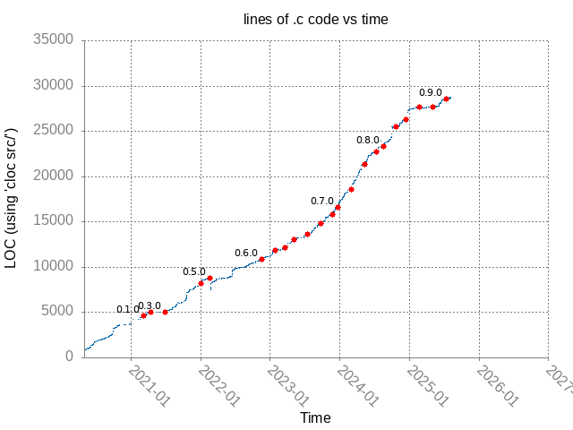

# What is this?

A couple of simple scripts that plot lines of C code in src/ versus time
using gnuplot.

# Usage

Copy `count.sh` to a clean `labwc` repo checked out at master.

Run

```
./count.sh $(head -n 1 /path/to/data.txt | awk '{ print $1 }') >> tmp.txt
```

Copy the contents of `tmp.txt` to the top of `data.txt`

Run `./plot.sh` and then view graph.png

# Output


